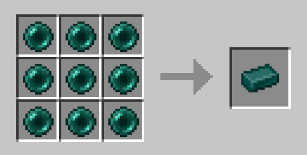
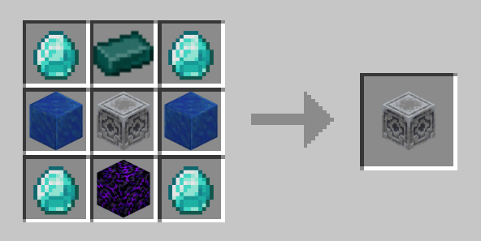
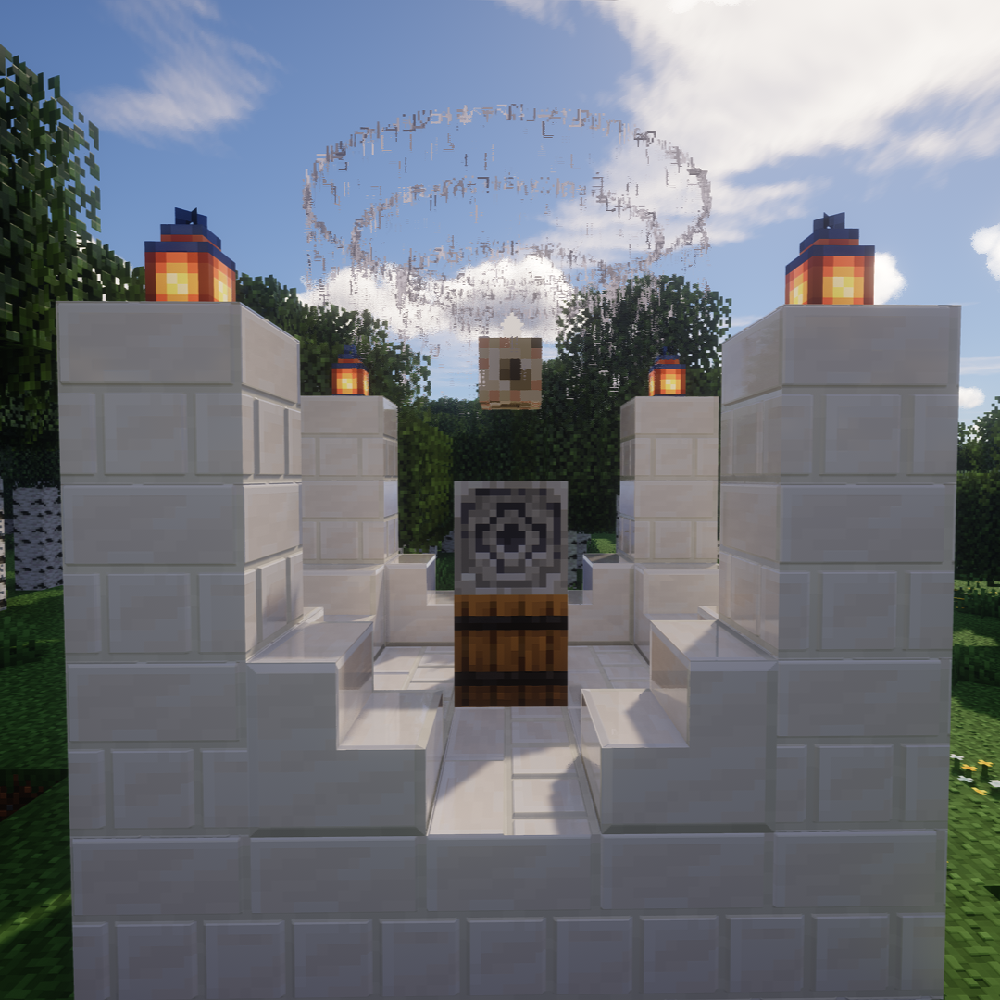

# 以太之门 - AetherGate

[English](README.md) | 简体中文

以太之门（AetherGate）是一个为 Minecraft Paper 服务器设计的沉浸式传送插件。它摒弃了指令传送（如 `/warp` 或 `/tpa`），引入了一套基于祭坛、资源消耗和视觉特效的平衡传送系统。

## 使用
### 合成
新增两个物品：末影锭、世界锚点

### 搭建
默认情况下请使用任意砖块和对应的砖楼梯（除了石英砖对应石英楼梯）进行搭建祭坛。按照底座5*5，四个角高为3的柱子；每个柱子顶部放置一个可照明方块，底部是向外方向的砖楼梯。中心处最底部是一个桶（可以用来储存传送消耗品：末影珍珠或末影锭），向上一个是'世界锚点'方块。

示例图:

### 激活
使用末影锭右键中间的'世界锚点'即可激活。
**注意**: 如果搭建不正确会发生爆炸。

### 充能
使用矿物方块（如铜块、铁块...等）右键'世界锚点'可以补充耐久。使用下界之星充能可以获得无限使用次数。随着矿物的等级增加，每个矿物块提供的耐久更多。

### 消耗
每次传送消耗末影珍珠（每玩家每次），若在各处没有检测到珍珠会拒绝传送。祭坛会优先从'世界锚点'下方的桶中查找末影锭或末影珍珠进行消耗，如果没有会查找祭坛5*5范围内的容器内的珍珠进行消耗（如果有珍珠优先消耗末影珍珠，若没有会自动分解末影锭），如果没有最后会查找玩家背包的珍珠进行消耗。

### 传送
右键中心潮涌核心，会打开书的GUI界面。上面展示了当前锚点的名字、剩余传送次数、充能状态和可以去往哪里，点击对应的传送按钮即可传送。

### 命名
使用已经命名的命名牌对'世界锚点'右键可以修改当前锚点的名字，方便传送使用。

### 耗尽
如果没有及时补充使用次数，在最后一次传送结束后，该祭坛会暗淡并破坏四个角的照明方块，但是该祭坛仍然可以被其他祭坛所传送。在下一次在该祭坛传送前请补充照明方块，否则会因为结构不完整发生爆炸。

## 协议
本项目采用 MIT 许可证，详见 [LICENSE](LICENSE) 文件。
